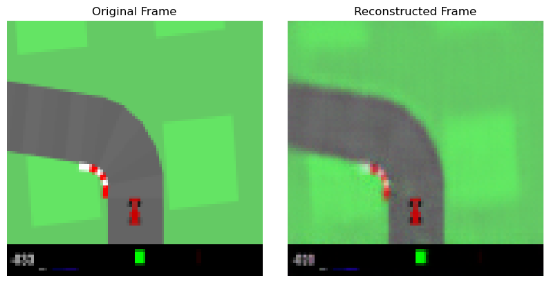

# World Models

A personal one-file implementation of David Ha's [world model](https://worldmodels.github.io/) architecture! You can train the whole pipeline through:

`python master_train.py --phases rollout vae latent rnn controller`

If you only want to train part of it, call the respective phase. Currently working on making this code generic and able to work on any environment. All the other files were porting over from the original code, but they will all be wiped once I'm happy with the main training code.

Currently working on getting the credits to do a full run and ensure the code all works. I've trained a small model on my own laptop to middling results.